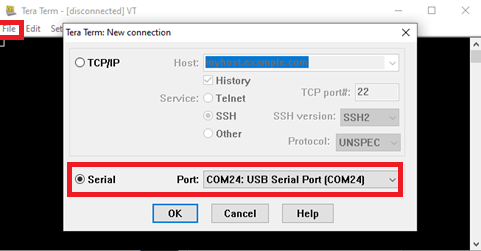
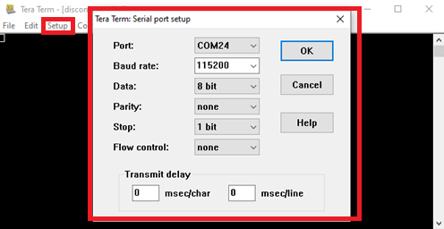
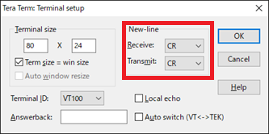
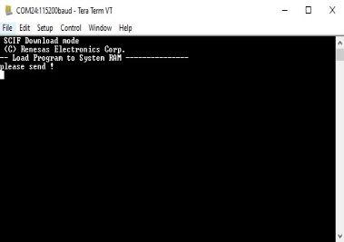
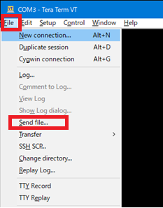
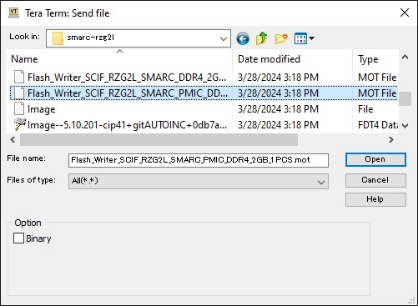
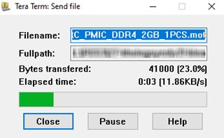

## Step 5: Reference Board Setting

### 1. Setup EVK's peripheral

Please setup following below diagram.

=== "RZ/G2L"

    

=== "RZ/G2LC"

    

=== "RZ/G2UL"

    

=== "RZ/G3S"

    

### 2. EVK's DIP switch

=== "RZ/G2L"

    EVK's DIP switch (SW1 and SW11) reference.

    * SW1

        <div class="grid cards" markdown>

        - **SD Card**

            ---

            !!! content-wrapper no-indent table-no-sort table-no-hover ""

                { align=left .switch-icon }

                |      SW1-1     |      SW1-2     |
                |:--------------:|:--------------:|
                | ON {: .green } | ON {: .green } |

        - **eMMC**

            ---

            !!! content-wrapper no-indent table-no-sort table-no-hover ""

                { align=left .switch-icon }

                |      SW1-1     |      SW1-2     |
                |:--------------:|:--------------:|
                | ON {: .green } |  OFF {: .red}  |

        </div>

    * SW11

        <div class="grid cards cards-fullwidth" markdown>

        - **SCIF Download Mode**

            ---

            !!! content-wrapper no-indent table-no-sort table-no-hover ""

                { align=left .switch-icon }

                |     SW11-1     |     SW11-2     |     SW11-3     |     SW11-4     |
                |:--------------:|:--------------:|:--------------:|:--------------:|
                |  OFF {: .red}  | ON {: .green } |  OFF {: .red}  | ON {: .green } |

        - **QSPI Boot Mode**

            ---

            !!! content-wrapper no-indent table-no-sort table-no-hover ""

                { align=left .switch-icon }

                |     SW11-1     |     SW11-2     |     SW11-3     |     SW11-4     |
                |:--------------:|:--------------:|:--------------:|:--------------:|
                |  OFF {: .red}  |  OFF {: .red}  |  OFF {: .red}  | ON {: .green } |

        - **eMMC Boot Mode**

            ---

            !!! content-wrapper no-indent table-no-sort table-no-hover ""

                { align=left .switch-icon }

                |     SW11-1     |     SW11-2     |     SW11-3     |     SW11-4     |
                |:--------------:|:--------------:|:--------------:|:--------------:|
                | ON {: .green } |  OFF {: .red}  |  OFF {: .red}  | ON {: .green } |

        - **eSD Boot Mode**

            ---

            !!! content-wrapper no-indent table-no-sort table-no-hover ""

                { align=left .switch-icon }

                |     SW11-1     |     SW11-2     |     SW11-3     |     SW11-4     |
                |:--------------:|:--------------:|:--------------:|:--------------:|
                | ON {: .green } | ON {: .green } |  OFF {: .red}  | ON {: .green } |

        </div>

        !!! note

            - Input voltage selection

                !!! content-wrapper no-indent table-no-sort table-no-hover ""

                    |     SW11-4     | Input voltage selection |
                    |:--------------:|:------------------------|
                    |  OFF {: .red}  | Input 9V                |
                    | ON {: .green } | Input 5V                |

=== "RZ/G2LC"

    EVK's DIP switch (SW1 and SW11) reference.

    * SW1

        <div class="grid cards cards-fullwidth" markdown>

        - **SD Card**

            ---

            !!! content-wrapper no-indent table-no-sort table-no-hover ""

                { align=left .switch-icon }

                |      SW1-1     |      SW1-2     |      SW1-3     |      SW1-4     |      SW1-5     |      SW1-6     |
                |:--------------:|:--------------:|:--------------:|:--------------:|:--------------:|:--------------:|
                | ON {: .green } | ON {: .green } | ON {: .green } | OFF {: .red }  | ON {: .green } | ON {: .green } |

        - **eMMC**

            ---

            !!! content-wrapper no-indent table-no-sort table-no-hover ""

                { align=left .switch-icon }

                |      SW1-1     |      SW1-2     |      SW1-3     |      SW1-4     |      SW1-5     |      SW1-6     |
                |:--------------:|:--------------:|:--------------:|:--------------:|:--------------:|:--------------:|
                | ON {: .green } | OFF {: .red }  | ON {: .green } | OFF {: .red }  | ON {: .green } | ON {: .green } |

        </div>

    * SW11

        <div class="grid cards cards-fullwidth" markdown>

        - **SCIF Download Mode**

            ---

            !!! content-wrapper no-indent table-no-sort table-no-hover ""

                { align=left .switch-icon }

                |     SW11-1     |     SW11-2     |     SW11-3     |     SW11-4     |
                |:--------------:|:--------------:|:--------------:|:--------------:|
                |  OFF {: .red}  | ON {: .green } |  OFF {: .red}  | ON {: .green } |

        - **QSPI Boot Mode**

            ---

            !!! content-wrapper no-indent table-no-sort table-no-hover ""

                { align=left .switch-icon }

                |     SW11-1     |     SW11-2     |     SW11-3     |     SW11-4     |
                |:--------------:|:--------------:|:--------------:|:--------------:|
                |  OFF {: .red}  |  OFF {: .red}  |  OFF {: .red}  | ON {: .green } |

        - **eMMC Boot Mode**

            ---

            !!! content-wrapper no-indent table-no-sort table-no-hover ""

                { align=left .switch-icon }

                |     SW11-1     |     SW11-2     |     SW11-3     |     SW11-4     |
                |:--------------:|:--------------:|:--------------:|:--------------:|
                | ON {: .green } |  OFF {: .red}  |  OFF {: .red}  | ON {: .green } |

        - **eSD Boot Mode**

            ---

            !!! content-wrapper no-indent table-no-sort table-no-hover ""

                { align=left .switch-icon }

                |     SW11-1     |     SW11-2     |     SW11-3     |     SW11-4     |
                |:--------------:|:--------------:|:--------------:|:--------------:|
                | ON {: .green } | ON {: .green } |  OFF {: .red}  | ON {: .green } |

        </div>

        !!! note

            - Input voltage selection

                !!! content-wrapper no-indent table-no-sort table-no-hover ""

                    |     SW11-4     | Input voltage selection |
                    |:--------------:|:------------------------|
                    |  OFF {: .red}  | Input 9V                |
                    | ON {: .green } | Input 5V                |

=== "RZ/G2UL"

    EVK's DIP switch (SW1 and SW11) reference.

    * SW1

        <div class="grid cards" markdown>

        - **SD Card**

            ---

            !!! content-wrapper no-indent table-no-sort table-no-hover ""

                { align=left .switch-icon }

                |      SW1-1     |      SW1-2     |      SW1-3     |
                |:--------------:|:--------------:|:--------------:|
                | ON {: .green } | ON {: .green } | ON {: .green } |

        - **eMMC**

            ---

            !!! content-wrapper no-indent table-no-sort table-no-hover ""

                { align=left .switch-icon }

                |      SW1-1     |      SW1-2     |      SW1-3     |
                |:--------------:|:--------------:|:--------------:|
                | ON {: .green } |  OFF {: .red}  | ON {: .green } |

        </div>

    * SW11

        <div class="grid cards cards-fullwidth" markdown>

        - **SCIF Download Mode**

            ---

            !!! content-wrapper no-indent table-no-sort table-no-hover ""

                { align=left .switch-icon }

                |     SW11-1     |     SW11-2     |     SW11-3     |     SW11-4     |
                |:--------------:|:--------------:|:--------------:|:--------------:|
                |  OFF {: .red}  | ON {: .green } |  OFF {: .red}  | ON {: .green } |

        - **QSPI Boot Mode**

            ---

            !!! content-wrapper no-indent table-no-sort table-no-hover ""

                { align=left .switch-icon }

                |     SW11-1     |     SW11-2     |     SW11-3     |     SW11-4     |
                |:--------------:|:--------------:|:--------------:|:--------------:|
                |  OFF {: .red}  |  OFF {: .red}  |  OFF {: .red}  | ON {: .green } |

        - **eMMC Boot Mode**

            ---

            !!! content-wrapper no-indent table-no-sort table-no-hover ""

                { align=left .switch-icon }

                |     SW11-1     |     SW11-2     |     SW11-3     |     SW11-4     |
                |:--------------:|:--------------:|:--------------:|:--------------:|
                | ON {: .green } |  OFF {: .red}  |  OFF {: .red}  | ON {: .green } |

        - **eSD Boot Mode**

            ---

            !!! content-wrapper no-indent table-no-sort table-no-hover ""

                { align=left .switch-icon }

                |     SW11-1     |     SW11-2     |     SW11-3     |     SW11-4     |
                |:--------------:|:--------------:|:--------------:|:--------------:|
                | ON {: .green } | ON {: .green } |  OFF {: .red}  | ON {: .green } |

        </div>

        !!! note

            - Input voltage selection

                !!! content-wrapper no-indent table-no-sort table-no-hover ""

                    |     SW11-4     | Input voltage selection |
                    |:--------------:|:------------------------|
                    |  OFF {: .red}  | Input 9V                |
                    | ON {: .green } | Input 5V                |

=== "RZ/G3S"

    EVK's DIP switch (SW_CONFIG and SW_MODE) reference.

    * SW_CONFIG

        <div class="grid cards cards-fullwidth" markdown>

        - **SD Card**

            ---

            !!! content-wrapper no-indent table-no-sort table-no-hover ""

                { align=left .switch-icon }

                |  SW_CONFIG[1]  |  SW_CONFIG[2]  |  SW_CONFIG[3]  |  SW_CONFIG[4]  |  SW_CONFIG[5]  |  SW_CONFIG[6]  |
                |:--------------:|:--------------:|:--------------:|:--------------:|:--------------:|:--------------:|
                |  OFF {: .red}  | ON {: .green } | ON {: .green } |  OFF {: .red}  |  OFF {: .red}  |  OFF {: .red}  |

        - **eMMC**

            ---

            !!! content-wrapper no-indent table-no-sort table-no-hover ""

                { align=left .switch-icon }

                |  SW_CONFIG[1]  |  SW_CONFIG[2]  |  SW_CONFIG[3]  |  SW_CONFIG[4]  |  SW_CONFIG[5]  |  SW_CONFIG[6]  |
                |:--------------:|:--------------:|:--------------:|:--------------:|:--------------:|:--------------:|
                |  OFF {: .red}  |  OFF {: .red}  | ON {: .green } |  OFF {: .red}  |  OFF {: .red}  |  OFF {: .red}  |

        </div>

    * SW_MODE

        <div class="grid cards cards-fullwidth" markdown>

        - **SCIF Download Mode**

            ---

            !!! content-wrapper no-indent table-no-sort table-no-hover ""

                { align=left .switch-icon }

                |   SW_MODE[1]   |   SW_MODE[2]   |   SW_MODE[3]   |   SW_MODE[4]   |
                |:--------------:|:--------------:|:--------------:|:--------------:|
                |  OFF {: .red}  | ON {: .green } |  OFF {: .red}  | ON {: .green } |

        - **QSPI Boot Mode**

            ---

            !!! content-wrapper no-indent table-no-sort table-no-hover ""

                { align=left .switch-icon }

                |   SW_MODE[1]   |   SW_MODE[2]   |   SW_MODE[3]   |   SW_MODE[4]   |
                |:--------------:|:--------------:|:--------------:|:--------------:|
                |  OFF {: .red}  |  OFF {: .red}  |  OFF {: .red}  | ON {: .green } |

        - **eMMC Boot Mode**

            ---

            !!! content-wrapper no-indent table-no-sort table-no-hover ""

                { align=left .switch-icon }

                |   SW_MODE[1]   |   SW_MODE[2]   |   SW_MODE[3]   |   SW_MODE[4]   |
                |:--------------:|:--------------:|:--------------:|:--------------:|
                | ON {: .green } |  OFF {: .red}  |  OFF {: .red}  | ON {: .green } |

        - **eSD Boot Mode**

            ---

            !!! content-wrapper no-indent table-no-sort table-no-hover ""

                { align=left .switch-icon }

                |   SW_MODE[1]   |   SW_MODE[2]   |   SW_MODE[3]   |   SW_MODE[4]   |
                |:--------------:|:--------------:|:--------------:|:--------------:|
                | ON {: .green } | ON {: .green } |  OFF {: .red}  | ON {: .green } |

        </div>

### 3. Prepare for Flashing Boot Loader into EVK

Connect the board to the programing PC by using the USB serial cable.

1. To set the board to SCIF Download mode, set the SW11 as below.

    === "RZ/G2L"

        !!! content-wrapper no-indent table-no-sort table-no-hover ""

            { align=left .switch-icon }

            |     SW11-1     |     SW11-2     |     SW11-3     |     SW11-4     |
            |:--------------:|:--------------:|:--------------:|:--------------:|
            |  OFF {: .red}  | ON {: .green } |  OFF {: .red}  | ON {: .green } |

    === "RZ/G2LC"

        !!! content-wrapper no-indent table-no-sort table-no-hover ""

            { align=left .switch-icon }

            |     SW11-1     |     SW11-2     |     SW11-3     |     SW11-4     |
            |:--------------:|:--------------:|:--------------:|:--------------:|
            |  OFF {: .red}  | ON {: .green } |  OFF {: .red}  | ON {: .green } |

    === "RZ/G2UL"

        !!! content-wrapper no-indent table-no-sort table-no-hover ""

            { align=left .switch-icon }

            |     SW11-1     |     SW11-2     |     SW11-3     |     SW11-4     |
            |:--------------:|:--------------:|:--------------:|:--------------:|
            |  OFF {: .red}  | ON {: .green } |  OFF {: .red}  | ON {: .green } |

    === "RZ/G3S"

        !!! content-wrapper no-indent table-no-sort table-no-hover ""

            { align=left .switch-icon }

            |   SW_MODE[1]   |   SW_MODE[2]   |   SW_MODE[3]   |   SW_MODE[4]   |
            |:--------------:|:--------------:|:--------------:|:--------------:|
            |  OFF {: .red}  | ON {: .green } |  OFF {: .red}  | ON {: .green } |

2. Press the power button to turn on the power.
    * When turning on the power, press and hold the power button for 1 second.
    * When turn off the power, press and hold the power button for 2 seconds

    === "RZ/G2L"

        

    === "RZ/G2LC"

        

    === "RZ/G2UL"

        

    === "RZ/G3S"

        

3. Bring up **TeraTerm** and select the **File** > **New Connection** to set the connection on the software.

    

4. Select the **Setup** > **Serial port** to set the settings about serial communication protocol on **TeraTerm**.

    Set the settings for the serial communication in **TeraTerm** as below:

    !!! content-wrapper no-indent table-no-sort table-no-hover ""

        |   Variable   |        Value          |
        |:------------:|:----------------------|
        | Baud rate    | `#!bash 115200` bps   |
        | Data         | `#!bash 8 bit`        |
        | Parity       | `#!bash none`         |
        | Stop         | `#!bash 1 bit`        |
        | Flow control | `#!bash none`         |

    

5. Select the **Setup** > **Terminal** to set the new-line code.

    !!! content-wrapper no-indent table-no-sort table-no-hover ""

        |   Variable   |             Value              |
        |:------------:|:-------------------------------|
        | New-line     | `#!bash CR` or `#!bash AUTO`   |

    

6. After finishing all settings, when the reset button is pressed, the message below will be displayed on the terminal.

    === "RZ/G2L"

        

    === "RZ/G2LC"

        

    === "RZ/G2UL"

        

    === "RZ/G3S"

        

    

### 4. Download Flash Writer to RAM

Flash Writer is a small program that is downloaded into internal RAM inside the target device to assist in programming the boot loader into Flash memory.

Turn on the power of the board by pressing SW9. The messages below are shown on the terminal.

``` console
 SCIF Download mode
 (C) Renesas Electronics Corp.

-- Load Program to SystemRAM ---------------
please send !
```

Send an image of `#!bash Flash Writer` using the terminal software after the message **please send !** is shown.

`#!bash Flash Writer` image file is:

=== "RZ/G2L"

    * `#!bash Flash_Writer_SCIF_RZG2L_SMARC_PMIC_DDR4_2GB_1PCS.mot`

=== "RZ/G2LC"

    * `#!bash Flash_Writer_SCIF_RZG2LC_SMARC_DDR4_1GB_1PCS.mot`

=== "RZ/G2UL"

    * `#!bash Flash_Writer_SCIF_RZG2UL_SMARC_DDR4_1GB_1PCS.mot`

=== "RZ/G3S"

    * `#!bash FlashWriter-smarc-rzg3s.mot`

Below is a sample procedure with **TeraTerm**.

1. Open a **Send file** dialog by selecting **File** > **Send file** menu.

    

    

2. Select the image to be send and click **Open** button.

    

3. The image will be sent to the board via serial connection.

    

4. After successfully downloading the binary, `#!bash Flash Writer` starts automatically and shows a message like below on the terminal.

    === "RZ/G2L"

        ``` console
        Flash writer for RZ/G2 Series V1.02 Nov.15,2021
        Product Code : RZ/G2L
        >
        ```

    === "RZ/G2LC"

        ``` console
        Flash writer for RZ/G2 Series V1.02 Nov.15,2021
        Product Code : RZ/G2LC
        >
        ```

    === "RZ/G2UL"

        ``` console
        Flash writer for RZ/G2 Series V1.02 Nov.15,2021
        Product Code : RZ/G2UL
        >
        ```

    === "RZ/G3S"

        ``` console
        Flash writer for RZ/G3 Series V1.02 Nov.15,2021
        Product Code : RZ/G3S
        >
        ```

### 5. Write the Bootloader

For the boot operation, two boot loader files need to be programming into the target board.

The corresponding bootloader files and specified address information depend on each target board.

Before writing the loader files, change the Flash Writer transfer rate from default (`#!bash 115200` bps) to high speed (`#!bash 921600` bps) with `#!bash SUP` (speed up) command of Flash Writer.

``` console
>SUP
Scif speed UP
Please change to 921.6Kbps baud rate setting of the terminal.
```

After issuing the `#!bash SUP` command, change the serial communication protocol speed from `#!bash 115200` bps to `#!bash 921600` bps as well, and push the enter key.

Next, use the `#!bash XLS2` command of Flash Writer to write boot loader binary files.

This command receives binary data from the serial port and writes the data to a specified address of the Flash ROM with information where the data should be loaded on the address of the main memory.

=== "RZ/G2L"

    For example, this part describes how to write boot loader files:

    ``` console
    >XLS2
    ===== Qspi writing of RZ/G2 Board Command =============
    Load Program to Spiflash
    Writes to any of SPI address.
     Micron : MT25QU512
    Program Top Address & Qspi Save Address
    ===== Please Input Program Top Address ============
      Please Input : H'11E00

    ===== Please Input Qspi Save Address ===
      Please Input : H'00000
    Work RAM(H'50000000-H'53FFFFFF) Clear....
    please send ! ('.' & CR stop load)
    ```

    Send the data of `#!bash bl2_bp_spi-smarc-rzg2l_pmic.srec` from terminal software after the message **please send !** is shown.

    After successfully downloading the binary, messages like below are shown on the terminal.

    ``` console
    SPI Data Clear(H'FF) Check :H'00000000-0000FFFF Erasing..Erase Completed
    SAVE SPI-FLASH.......
    ======= Qspi  Save Information  =================
     SpiFlashMemory Stat Address : H'00000000
     SpiFlashMemory End Address  : H'0000BAC8
    ===========================================================
    ```

    !!! note

        ``` console
        SPI Data Clear(H'FF) Check : H'00000000-0000FFFF,Clear OK?(y/n)
        ```

        In case a message to prompt to clear data like above, please enter ++y++.

    Next, write another loader file by using `#!bash XLS2` command again.

    ``` console
    >XLS2
    ===== Qspi writing of RZ/G2 Board Command =============
    Load Program to Spiflash
    Writes to any of SPI address.
     Micron : MT25QU512
    Program Top Address & Qspi Save Address
    ===== Please Input Program Top Address ============
      Please Input : H'00000

    ===== Please Input Qspi Save Address ===
      Please Input : H'20000
    Work RAM(H'50000000-H'53FFFFFF) Clear....
    please send ! ('.' & CR stop load)
    ```

    Send the data of `#!bash fip-smarc-rzg2l_pmic.srec` from terminal software after the message **please send !** is shown.

    After successfully downloading the binary, messages like below are shown on the terminal.

    ``` console
    SPI Data Clear(H'FF) Check :H'00000000-0000FFFF Erasing..Erase Completed
    SAVE SPI-FLASH.......
    ======= Qspi  Save Information  =================
     SpiFlashMemory Stat Address : H'00020000
     SpiFlashMemory End Address  : H'000CC73F
    ===========================================================
    ```

    !!! note

        ``` console
        SPI Data Clear(H'FF) Check : H'00000000-0000FFFF,Clear OK?(y/n)
        ```

        In case a message to prompt to clear data like above, please enter ++y++.

    After writing the two loader files normally, change the serial communication protocol speed from `#!bash 921600` bps to `#!bash 115200` bps.

    At last, turn off the power of the board by pressing SW9.

    !!! note

        - Address for sending each loader binary file for QSPI boot

            !!! content-wrapper no-indent table-no-sort table-no-hover ""

                |                 File name                 | Address to load to RAM | Address to save to ROM |
                |:-----------------------------------------:|:----------------------:|:----------------------:|
                | `#!bash bl2_bp_spi-smarc-rzg2l_pmic.srec` | `#!bash 11E00`         | `#!bash 00000`         |
                | `#!bash fip-smarc-rzg2l_pmic.srec`        | `#!bash 00000`         | `#!bash 20000`         |

=== "RZ/G2LC"

    For example, this part describes how to write boot loader files:

    ``` console
    >XLS2
    ===== Qspi writing of RZ/G2 Board Command =============
    Load Program to Spiflash
    Writes to any of SPI address.
     Micron : MT25QU512
    Program Top Address & Qspi Save Address
    ===== Please Input Program Top Address ============
      Please Input : H'11E00

    ===== Please Input Qspi Save Address ===
      Please Input : H'00000
    Work RAM(H'50000000-H'53FFFFFF) Clear....
    please send ! ('.' & CR stop load)
    ```

    Send the data of `#!bash bl2_bp_spi-smarc-rzg2lc.srec` from terminal software after the message **please send !** is shown.

    After successfully downloading the binary, messages like below are shown on the terminal.

    ``` console
    SPI Data Clear(H'FF) Check :H'00000000-0000FFFF Erasing..Erase Completed
    SAVE SPI-FLASH.......
    ======= Qspi  Save Information  =================
     SpiFlashMemory Stat Address : H'00000000
     SpiFlashMemory End Address  : H'0000BAC8
    ===========================================================
    ```

    !!! note

        ``` console
        SPI Data Clear(H'FF) Check : H'00000000-0000FFFF,Clear OK?(y/n)
        ```

        In case a message to prompt to clear data like above, please enter ++y++.

    Next, write another loader file by using `#!bash XLS2` command again.

    ``` console
    >XLS2
    ===== Qspi writing of RZ/G2 Board Command =============
    Load Program to Spiflash
    Writes to any of SPI address.
     Micron : MT25QU512
    Program Top Address & Qspi Save Address
    ===== Please Input Program Top Address ============
      Please Input : H'00000

    ===== Please Input Qspi Save Address ===
      Please Input : H'20000
    Work RAM(H'50000000-H'53FFFFFF) Clear....
    please send ! ('.' & CR stop load)
    ```

    Send the data of `#!bash fip-smarc-rzg2lc.srec` from terminal software after the message **please send !** is shown.

    After successfully downloading the binary, messages like below are shown on the terminal.

    ``` console
    SPI Data Clear(H'FF) Check :H'00000000-0000FFFF Erasing..Erase Completed
    SAVE SPI-FLASH.......
    ======= Qspi  Save Information  =================
     SpiFlashMemory Stat Address : H'00020000
     SpiFlashMemory End Address  : H'000CC73F
    ===========================================================
    ```

    !!! note

        ``` console
        SPI Data Clear(H'FF) Check : H'00000000-0000FFFF,Clear OK?(y/n)
        ```

        In case a message to prompt to clear data like above, please enter ++y++.

    After writing the two loader files normally, change the serial communication protocol speed from `#!bash 921600` bps to `#!bash 115200` bps.

    At last, turn off the power of the board by pressing SW9.

    !!! note

        - Address for sending each loader binary file for QSPI boot

            !!! content-wrapper no-indent table-no-sort table-no-hover ""

                |                 File name                 | Address to load to RAM | Address to save to ROM |
                |:-----------------------------------------:|:----------------------:|:----------------------:|
                | `#!bash bl2_bp_spi-smarc-rzg2lc.srec`     | `#!bash 11E00`         | `#!bash 00000`         |
                | `#!bash fip-smarc-rzg2lc.srec`            | `#!bash 00000`         | `#!bash 20000`         |

=== "RZ/G2UL"

    For example, this part describes how to write boot loader files:

    ``` console
    >XLS2
    ===== Qspi writing of RZ/G2 Board Command =============
    Load Program to Spiflash
    Writes to any of SPI address.
     Micron : MT25QU512
    Program Top Address & Qspi Save Address
    ===== Please Input Program Top Address ============
      Please Input : H'11E00

    ===== Please Input Qspi Save Address ===
      Please Input : H'00000
    Work RAM(H'50000000-H'53FFFFFF) Clear....
    please send ! ('.' & CR stop load)
    ```

    Send the data of `#!bash bl2_bp_spi-smarc-rzg2ul.srec` from terminal software after the message **please send !** is shown.

    After successfully downloading the binary, messages like below are shown on the terminal.

    ``` console
    SPI Data Clear(H'FF) Check :H'00000000-0000FFFF Erasing..Erase Completed
    SAVE SPI-FLASH.......
    ======= Qspi  Save Information  =================
     SpiFlashMemory Stat Address : H'00000000
     SpiFlashMemory End Address  : H'0000BAC8
    ===========================================================
    ```

    !!! note

        ``` console
        SPI Data Clear(H'FF) Check : H'00000000-0000FFFF,Clear OK?(y/n)
        ```

        In case a message to prompt to clear data like above, please enter ++y++.

    Next, write another loader file by using `#!bash XLS2` command again.

    ``` console
    >XLS2
    ===== Qspi writing of RZ/G2 Board Command =============
    Load Program to Spiflash
    Writes to any of SPI address.
     Micron : MT25QU512
    Program Top Address & Qspi Save Address
    ===== Please Input Program Top Address ============
      Please Input : H'00000

    ===== Please Input Qspi Save Address ===
      Please Input : H'20000
    Work RAM(H'50000000-H'53FFFFFF) Clear....
    please send ! ('.' & CR stop load)
    ```

    Send the data of `#!bash fip-smarc-rzg2ul.srec` from terminal software after the message **please send !** is shown.

    After successfully downloading the binary, messages like below are shown on the terminal.

    ``` console
    SPI Data Clear(H'FF) Check :H'00000000-0000FFFF Erasing..Erase Completed
    SAVE SPI-FLASH.......
    ======= Qspi  Save Information  =================
     SpiFlashMemory Stat Address : H'00020000
     SpiFlashMemory End Address  : H'000CC73F
    ===========================================================
    ```

    !!! note

        ``` console
        SPI Data Clear(H'FF) Check : H'00000000-0000FFFF,Clear OK?(y/n)
        ```

        In case a message to prompt to clear data like above, please enter ++y++.

    After writing the two loader files normally, change the serial communication protocol speed from `#!bash 921600` bps to `#!bash 115200` bps.

    At last, turn off the power of the board by pressing SW9.

    !!! note

        - Address for sending each loader binary file for QSPI boot

            !!! content-wrapper no-indent table-no-sort table-no-hover ""

                |                 File name                 | Address to load to RAM | Address to save to ROM |
                |:-----------------------------------------:|:----------------------:|:----------------------:|
                | `#!bash bl2_bp_spi-smarc-rzg2ul.srec`     | `#!bash 11E00`         | `#!bash 00000`         |
                | `#!bash fip-smarc-rzg2ul.srec`            | `#!bash 00000`         | `#!bash 20000`         |

=== "RZ/G3S"

    For example, this part describes how to write boot loader files:

    ``` console
    >XLS2
    ===== Qspi writing of RZ/G3 Board Command =============
    Load Program to Spiflash
    Writes to any of SPI address.
     Micron : MT25QU512
    Program Top Address & Qspi Save Address
    ===== Please Input Program Top Address ============
      Please Input : H'A1E00

    ===== Please Input Qspi Save Address ===
      Please Input : H'00000
    Work RAM(H'50000000-H'53FFFFFF) Clear....
    please send ! ('.' & CR stop load)
    ```

    Send the data of `#!bash bl2_bp_spi-smarc-rzg3s.srec` from terminal software after the message **please send !** is shown.

    After successfully downloading the binary, messages like below are shown on the terminal.

    ``` console
    SPI Data Clear(H'FF) Check :H'00000000-0000FFFF Erasing..Erase Completed
    SAVE SPI-FLASH.......
    ======= Qspi  Save Information  =================
     SpiFlashMemory Stat Address : H'00000000
     SpiFlashMemory End Address  : H'0001ECC8
    ===========================================================
    ```

    !!! note

        ``` console
        SPI Data Clear(H'FF) Check : H'00000000-0000FFFF,Clear OK?(y/n)
        ```

        In case a message to prompt to clear data like above, please enter ++y++.

    Next, write another loader file by using `#!bash XLS2` command again.

    ``` console
    >XLS2
    ===== Qspi writing of RZ/G3 Board Command =============
    Load Program to Spiflash
    Writes to any of SPI address.
     Micron : MT25QU512
    Program Top Address & Qspi Save Address
    ===== Please Input Program Top Address ============
      Please Input : H'00000

    ===== Please Input Qspi Save Address ===
      Please Input : H'60000
    Work RAM(H'50000000-H'53FFFFFF) Clear....
    please send ! ('.' & CR stop load)
    ```

    Send the data of `#!bash fip-smarc-rzg3s.srec` from terminal software after the message **please send !** is shown.

    After successfully downloading the binary, messages like below are shown on the terminal.

    ``` console
    SPI Data Clear(H'FF) Check :H'00000000-0000FFFF Erasing..Erase Completed
    SAVE SPI-FLASH.......
    ======= Qspi  Save Information  =================
     SpiFlashMemory Stat Address : H'00060000
     SpiFlashMemory End Address  : H'0014267E
    ===========================================================
    ```

    !!! note

        ``` console
        SPI Data Clear(H'FF) Check : H'00000000-0000FFFF,Clear OK?(y/n)
        ```

        In case a message to prompt to clear data like above, please enter ++y++.

    After writing the two loader files normally, change the serial communication protocol speed from `#!bash 921600` bps to `#!bash 115200` bps.

    At last, turn off the power of the board by pressing SW9.

    !!! note

        - Address for sending each loader binary file for QSPI boot

            !!! content-wrapper no-indent table-no-sort table-no-hover ""

                |                 File name                 | Address to load to RAM | Address to save to ROM |
                |:-----------------------------------------:|:----------------------:|:----------------------:|
                | `#!bash bl2_bp_spi-smarc-rzg3s.srec`      | `#!bash A1E00`         | `#!bash 00000`         |
                | `#!bash fip-smarc-rzg3s.srec`             | `#!bash 00000`         | `#!bash 60000`         |
