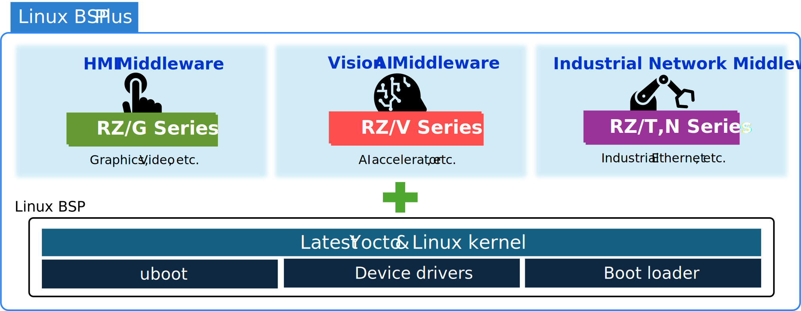
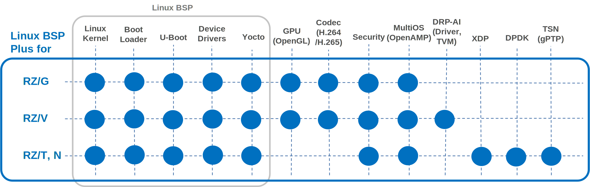

# Renesas RZ Linux BSP Plus

Renesas RZ Linux BSP Plus
{: .subtitle .center }

A S/W package with latest LTS Kernel and Yocto support running on Renesas EVK.
{: .sub-subtitle .center }

{ width=100% }

* Linux BSP Plus is a software package with latest Linux LTS kernel and Yocto support running on EVK
    This software package of each product has a minimal configuration. 

* Linux BSP Plus target users are Linux expert skilled engineers.
    (Need Linux-based development experience and can use OSS while solving issues by themselves)

* Linux BSP and middleware specialized for each RZ MPU series target applications are supported.

{ width=100% }




